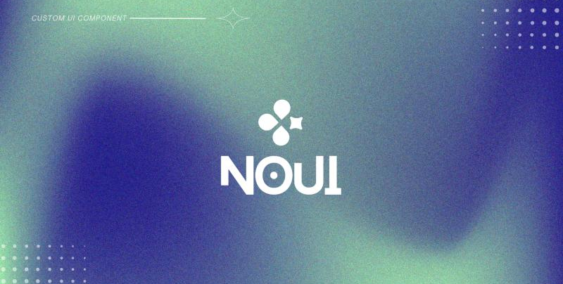
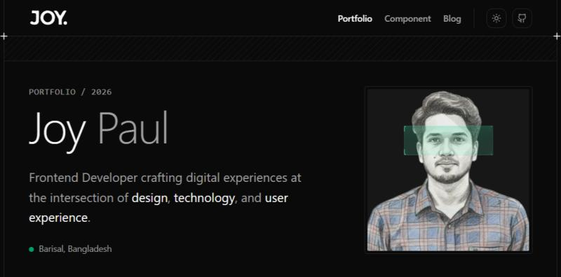
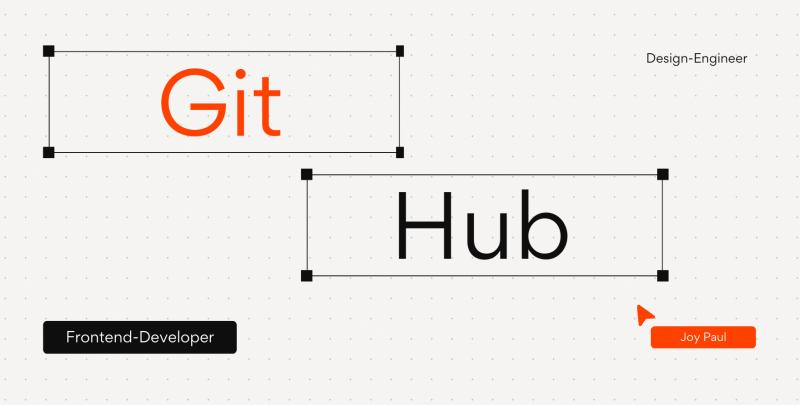

<div align="center">

```
     ██╗ ██████╗ ██╗   ██╗    ██████╗  █████╗ ██╗   ██╗██╗
     ██║██╔═══██╗╚██╗ ██╔╝    ██╔══██╗██╔══██╗██║   ██║██║
     ██║██║   ██║ ╚████╔╝     ██████╔╝███████║██║   ██║██║
██   ██║██║   ██║  ╚██╔╝      ██╔═══╝ ██╔══██║██║   ██║██║
     ╚█████╔╝╚██████╔╝   ██║       ██║     ██║  ██║╚██████╔╝███████╗
      ╚════╝  ╚═════╝    ╚═╝       ╚═╝     ╚═╝  ╚═╝ ╚═════╝ ╚══════╝
```

</div>

<table border="0" cellspacing="0" cellpadding="6">
  <tr>
    <td align="left" width="75%">
      <strong>Design-Engineer &nbsp;·&nbsp; UI Architect</strong>
    </td>
  </tr>
</table>

## Hi 👋, I'm Joy

A creative Design-Engineer — focused on **clean UI**, **smooth interactions**, and **great user experiences**. I craft production-grade Next.js applications where every detail is intentional, every interaction feels natural, and performance is never an afterthought.

## Core Stack

[](https://skillicons.dev)

## What I'm Focused On

```js
const currentFocus = {
  building: "Reusable UI components, layouts & design systems with Next.js",
  learning: [
    "Advanced TypeScript patterns",
    "Jest & unit testing strategies",
    "Redux Toolkit & async state management",
  ],
  reading: "Designing with Components — UI Architecture for Scale",
  principle: "Great UI is not just how it looks — it's how it works.",
};
```

## Projects - showcase

<table border="1" cellpadding="8" cellspacing="0">
  <tr>
    <td valign="top" width="33%">
      <a href="https://no-ui.vercel.app/">
        
      </a>
      <br/><br/>
      <b>NoUi — Less Noise, More UI</b><br/>
      <sub>Custom Next.js components crafted for flexible frontend workflows.</sub>
      <br/><br/>
      <a href="https://no-ui.vercel.app/"></a>
    </td>
    <td valign="top" width="33%">
      <a href="https://github.com/maximus-soares/Projects/blob/main/CICD%20Pipeline/Set%20Up%20a%20Web%20App%20in%20the%20Cloud.md">
  
      </a>
      <br/><br/>
      <b>JoyPaul-Portfolio</b><br/>
      <sub>Welcome to my personal portfolio—explore my latest work and feel free to connect.</sub>
      <br/><br/>
        <a href="https://portfolio-2026-theta-seven.vercel.app"></a>
    </td>
    <td valign="top" width="33%">
      <a href="https://github.com/maximus-soares/Projects/blob/main/Networking/1%20Build%20a%20VPC.md">
         
      </a>
      <br/><br/>
      <b>GitHub</b><br/>
      <sub>You’re welcome to check out my GitHub—exploring and collaboration are always welcome.</sub>
      <br/><br/>
      <a href="https://github.com/joypaul3592"></a>
    </td>
  </tr>
</table>
